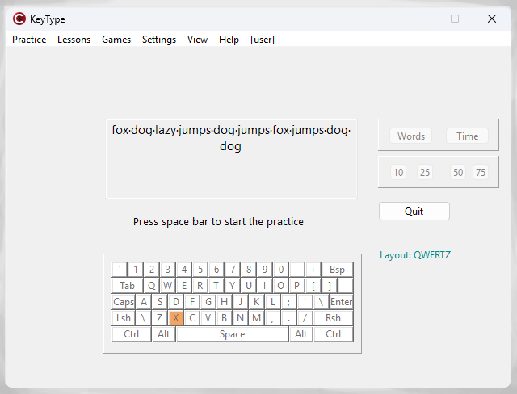

## Typing practice app

This is a versatile typing practice app developed as part of an Advanced programming techniques class project. The app showcases some of the more advanced programming concepts in C++ Builder and VCL library.

**User-oriented features:**
- test your typing skills with customizable practice text and options (virtual keyboard shows pressed keys)
- learn touch typing through courses and lessons
- challenge yourself with the in-app game "Flying Words" (type the flying words before they disappear)
- view detailed lesson stats and overall performance
- track your typing achievements
- configure settings
- diagnose app behavior with logging messages

**Core technical features:**
- multi-language user interface with dynamic selection
- app settings stored in INI file and Windows registry
- data management with XML, JSON and custom file format
- CRUD operations with MySQL
- lookup and calculated fields, including BLOB fields
- automatic report generation with FastReports
- multi-threading support in the "Flying Words" game
- thread synchronization using mutexes and critical sections
- safe UI updates from the main thread
- log archiving and compression tool
- TCP client/ server and UDP client/ server
- SOAP client/ server and REST client/ server, both as IIS ISAPI plugins
- symmetric and asymmetric cryptography
- hashing with variable salt and pepper
- digital signature support
- custom static and dynamic libraries
- diagrams with TeeChart
- unit testing with DUnit

**Build instructions:**
- build all projects (RAD Studio 11)
- place GeneratorLib.Lib in the src\ and src\Server folders, place AboutLib.dll, StatisticsLib.dll, ResourceLib.dll in the src\Win32\Debug folder
- place SOAPServer.dll and RESTServer.dll in inetpub\wwwroot folder along with pub_key.bin from the src\Keys folder
- create MySQL database from the script in the src/Db folder
- start IIS with permissions to execute ISAPI dll's
- start TCP and UDP server